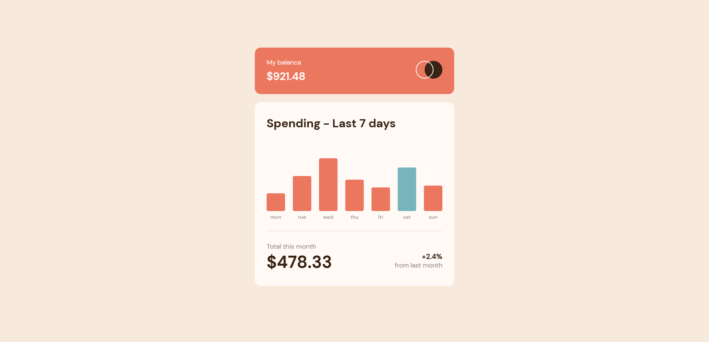
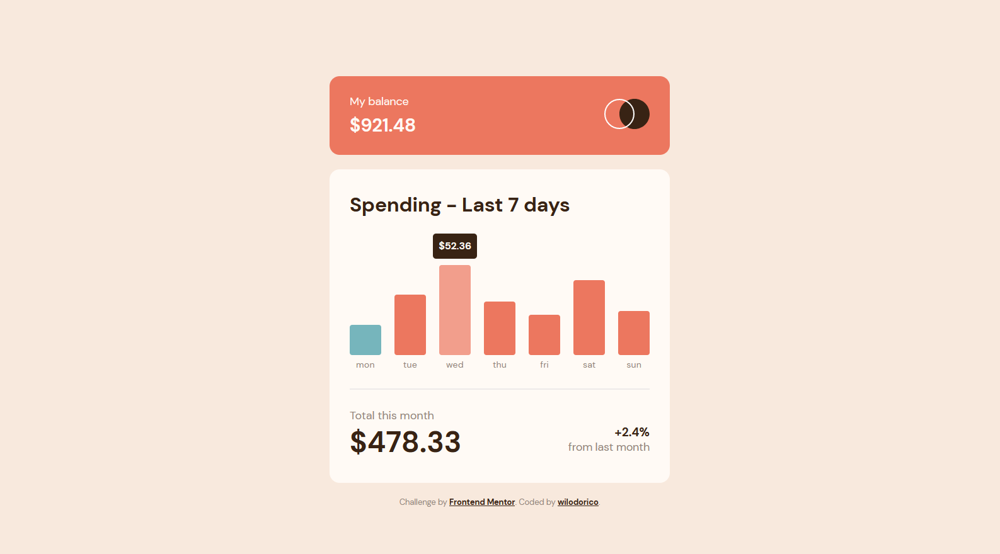
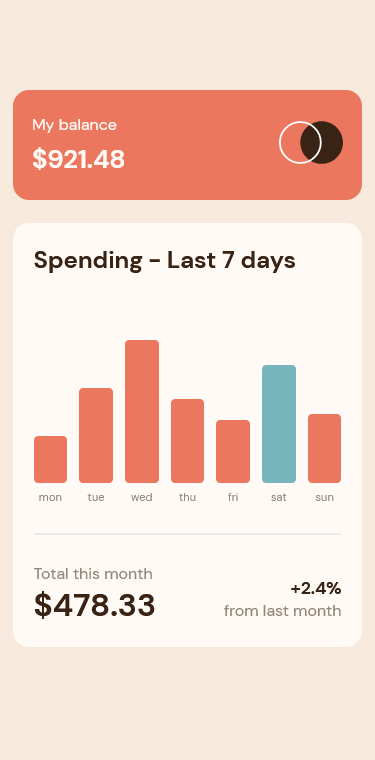

# Frontend Mentor - Expenses chart component solution

This is a solution to the [Expenses chart component challenge on Frontend Mentor](https://www.frontendmentor.io/challenges/expenses-chart-component-e7yJBUdjwt). Frontend Mentor challenges help you improve your coding skills by building realistic projects. 

## Table of contents

- [Overview](#overview)
  - [The challenge](#the-challenge)
  - [Screenshot](#screenshot)
  - [Links](#links)
- [My process](#my-process)
  - [Built with](#built-with)
  - [What I learned](#what-i-learned)
  - [Continued development](#continued-development)
  - [Useful resources](#useful-resources)
- [Author](#author)
- [Acknowledgments](#acknowledgments)

## Overview

### The challenge

Users should be able to:

- View the bar chart and hover over the individual bars to see the correct amounts for each day
- See the current day’s bar highlighted in a different colour to the other bars
- View the optimal layout for the content depending on their device’s screen size
- See hover states for all interactive elements on the page
- **Bonus**: Use the JSON data file provided to dynamically size the bars on the chart

### Screenshot

### Links

- Solution URL: [Click here](https://github.com/wilodorico/expenses-chart-challenge)
- Live Site URL: [Click here](https://expense-chart-junior-challenge.netlify.app/)

## My process

### Built with

- Semantic HTML5 markup
- CSS custom properties
- Flexbox
- [React](https://reactjs.org/) - JS library
- [Styled Components](https://styled-components.com/) - For styles

### What I learned

- Reusable component
- conditional rendering
- props rendering
- data manipulation
- Responsive design
- @media query

### Useful resources

- [MDN](https://developer.mozilla.org/fr/)
- [styled-components](https://styled-components.com) - props rendering.
- [stackoverflow](https://stackoverflow.com/questions/41970493/how-to-control-position-and-colour-of-title-text-in-html-href-element) - help to design the title attribute

## Author

- Website - [@wilodorico](https://www.wilodorico.fr)
- Frontend Mentor - [@wilodorico](https://www.frontendmentor.io/profile/wilodorico)
- Twitter - [@wilodorico](https://www.twitter.com/wilodorico)

## Acknowledgments

Thank @dazzlerabhi30800 Frontend Mentor
